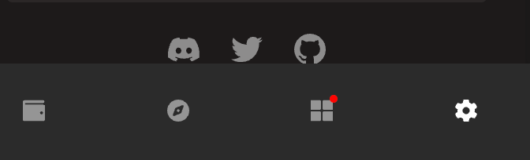
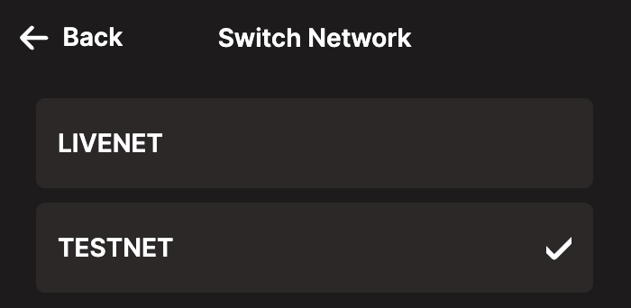
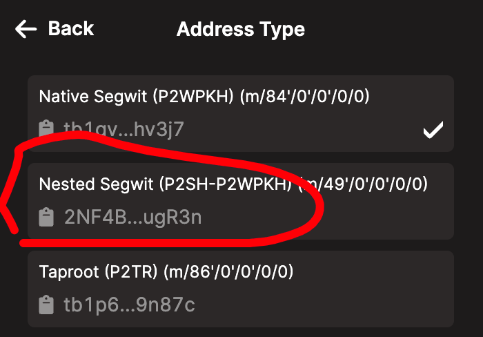
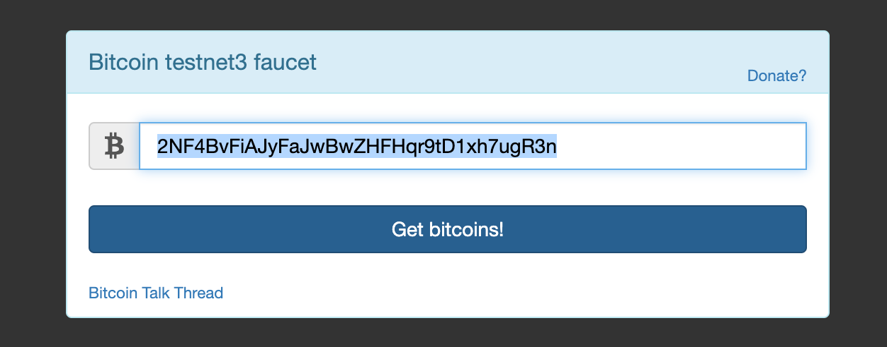
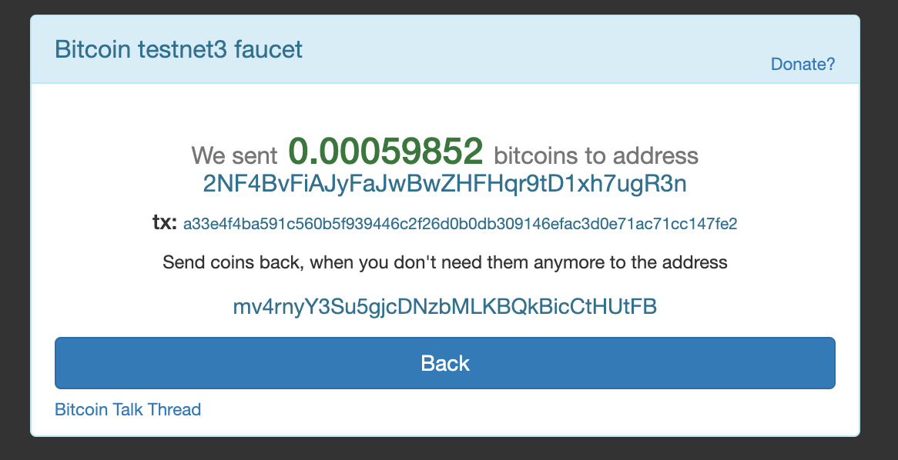
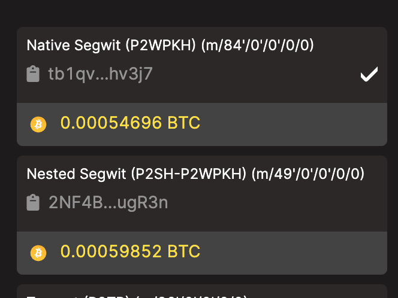

## 选择测试网络
* 选择设置

* 切换到测试网

* 返回设置主界面，设置地址类型，选择 Nested Segwit

### 简述一下不同比特币地址类型的区别
* Native SegWit（Bech32）： 以"bc1"开头，测试网以“tb1”开头，使用这种地址的交易通常较小，交易便宜，因为它们不需要嵌套在P2SH脚本中，从而减少了交易的大小。
* Nested SegWit（P2SH-P2WPKH）： 以"3"开头，测试网以“2”，由于需要嵌套在P2SH脚本中，交易费略贵，交易大小相对较大。

## 领取测试Token
* 需要访问地址：`https://coinfaucet.eu/en/btc-testnet/`
* 我的地址是：2NF4BvFiAJyFaJwBwZHFHqr9tD1xh7ugR3n 

* 实际上 tb 和 2n 开头的地址都能领取到，每过24小时可以领取一次，主要看的是IP
